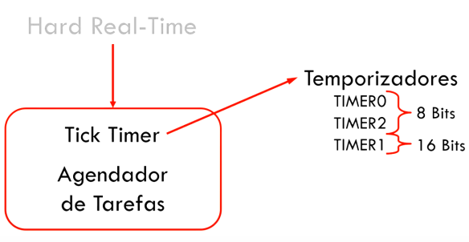
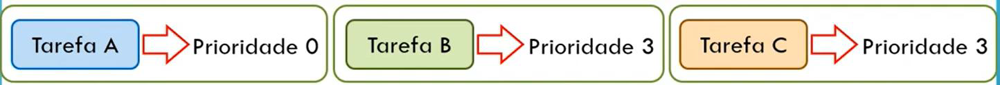
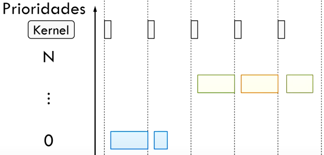
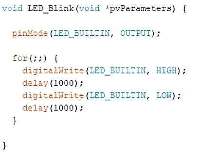
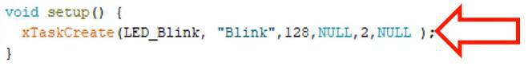
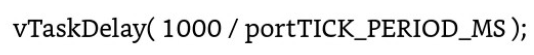
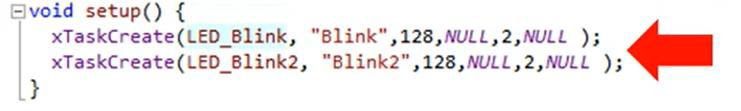

Experimento 2: Criando e Aplicando o Conceito de
Tarefas com FreeRTOS
Valor: 2,5 pontos de 10
_____________________________________________________________________________
Problema: Considere um sistema de controle de distância de um robô em que além
de verificação de distância em suas 4 laterais é necessário controle de velocidade
das 4 rodas. Para a verificação de obstáculos são utilizados 4 sensores
ultrassônicos e para movimentação, 4 motores cc. Assim são consideradas as
seguintes regras:
1 – A lei de controle que delimita a tensão de atuação via PWM dos motores deve
incrementar e decrementar o dutycicle, exponencialmente, a medida que o sensor
indica um afastamento ou aproximação respectivamente.
2- A verificação de distância de cada sensor é considerada uma tarefa (bibliotecas
são permitidas).
3 – A tarefa de controle dos 4 motores é única.
Obs: O Aluno deve definir a periodicidade de cada tarefa de acordo com a
necessidade do problema.
Objetivo: Desenvolver um sistema escalonado em executivo cíclico através de
chamadas de função.
_____________________________________________________________________________
Dispositivos necessários: Simulado ou Experimental
• Computador;
• Simulador (wokwi)
FreeRTOS
A FreeRTOS utiliza um sistema de contagem de tempo chamado de TickTimer,
como exemplo, o ATMega usa 3 timers:

O WDT tambem pode ser utilizado para gerar tickTimer, principalmente quando há
um overhead de tarefa.
Ao se criar tarefas é possível indicar prioridades a elas:

Cada tarefa utiliza uma determinada quantidade de Ticks e o FreeRTOs os escalona
conforme prioridade e disponibilidade da tarefa. Caso, uma tarefa não termine de
executar em um Tick, esta é interrompida e retorna para fila de apitos, dando
espaço para uma outra tarefa:

O primeiro passo para o uso da FreeRTOS é a instalação e posteriormente a
inclusão da biblioteca ao projeto:
Agora podemos criar a tarefa, conjunto de código a ser executado, por exemplo,
fazer um LED ligar e desligar indefinidamente:

Para o FreeRTOS a tarefa nunca retorna nada, logo, são do tipo void e como
passagem de parâmetro a entrada de um ponteiro, obrigatoriamente do tipo void.
Esta é a construção obrigatória de uma tarefa.
Definida a tarefa, esta deve ser instanciada dentro da função setup() conforme
segue:

A xTaskCreate deve receber 6 parâmetros, divididos em conforme descrição:
1. Tarefa a ser executada
2. Texto que serve apenas para se interpretar a função dessa tarefa
3. Tamanho da pilha que esta tarefa poderá utilizar para executar suas funções
(Stack size)
4. Ponteiro com um parâmetro que se deseja passar à tarefa
5. Nível de prioridade
6. Ponteiro para uma outra tarefa que trabalha esta tarefa
No caso apresentado, a tarefa será executada até o estouro do tick, será
interrompida e verificado se há outra tarefa a ser executada. Como não há, o kernel
retomara a tarefa Blink.
Outra função importante é a “vTaskStartScheduller();”. Ela inicia o agendador de
tarefas do kernel, pegando todas as tarefas criadas pela xTaskCreate e as
organizando. Esta função já está embutida na execução, sem a necessidade de
indicá-la no código.
Como contagem de tempo aconselha-se o uso das ferramentas da própria
biblioteca. Como exemplo, uma espera de tempo de 1 segundo:

Em uma programação concorrente, temos mais de uma tarefa. Estas irão
concorrer sempre que a prioridade for igual:

Atividade________________________________________________
Tarefa 1: Defina as características de tempo real de cada tarefa, realizando testes
de tempo de computação de cada tarefa utilizando a Biblioteca FreeRTOS;
Tarefa 2: Esquematize a execução através de um diagrama de fluxo temporal em
um sistema de ciclo único maior e com um sistema de ciclos menor; Utilize a
habilitação e desabilitação de tarefas da biblioteca (Lembre de avaliar a viabilidade
de cada esquema)
Tarefa 3: Avalie o desempenho de execução em uma lógica de livre demanda do
processador, ou seja, utilize as tarefas sem forçar sua habilitação ou desabilitação.
Tarefa 4: Desenvolva o relatório do experimento.
Da Avaliação do relatório:
• Devem ser apresentados os códigos com resultados simulados
• Os ajustes de tempo devem estar bem descritos
• Os questionamentos devem ser bem respondidos e destalhados.